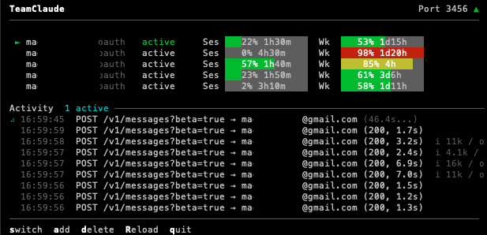

# TeamClaude

Multi-account Claude proxy with automatic quota-based rotation for [Claude Code](https://claude.ai/claude-code).

Sits transparently between Claude Code and the Anthropic API, managing multiple Claude Max (or API key) accounts and automatically switching when one approaches its session or weekly quota limit.



## Features

- **Use-or-lose account priority** — measures each account once at startup, then prioritizes the account whose weekly (7d) quota resets soonest (then soonest session reset, then lowest usage), so quota about to renew unused is drained first; re-evaluates every 5 minutes and switches immediately when the active account reaches the quota threshold (default 98%). Pin explicit ranks in the TUI (`o`) or via `teamclaude priority` for the accounts you want first — everything unranked stays on this automatic (`auto`) ordering
- **Instant failover on 429** — an exhausted account (token quota hit) is throttled for its `retry-after` (clamped to 1s–5m) and skipped; a rate/concurrency 429 (quota left but hit too fast) fails the request over to another account so concurrent overflow spreads instead of erroring. Either way nothing blocks, and a request-global 429 only passes through after every account has been tried — never throttling the fleet
- **Interactive TUI** — real-time dashboard with color-coded quota bars showing usage %, reset countdowns, an activity log, and keyboard controls (switch, enable/disable, reorder accounts)
- **Manual account controls** — enable/disable accounts and pin an explicit account order from the TUI or CLI (`teamclaude disable|enable|priority`); a disabled account is excluded from rotation while its in-flight requests drain, and everything unranked stays on automatic use-or-lose ordering
- **Quota survives restarts** — per-account quota state *and* the warm-up probe template are snapshotted to `<config>.quota.json` (every minute and on exit) and restored at startup, so a restart doesn't blank the dashboard, blind the account ordering, or leave forced re-measure (**R**) dead until traffic flows again
- **Active warm-up** — after a (re)start the proxy probes still-unmeasured accounts with a minimal request (reusing the shape of the first real request, restored across restarts), so the whole fleet's quota populates within seconds instead of waiting for traffic to reach each account
- **Server lifecycle** — `teamclaude stop` / `teamclaude restart` cleanly stop or replace the running server from any terminal
- **OAuth token management** — automatically refreshes tokens nearing expiry and persists them to config; client token refreshes pass through untouched
- **Hot-reload accounts** — add accounts via `import` or `login` while the server is running, press **R** to pick them up; **R** also force-re-measures the whole fleet's quota, so the dashboard reflects usage spent outside this proxy (other devices/sessions) — and works right after a restart, since the probe template is restored from the snapshot
- **Account deduplication** — detects duplicate accounts by UUID and keeps the most recent
- **Request logging** — optional full request/response logging for debugging
- **Zero dependencies** — uses only Node.js built-in modules

## Quick Start

Requires Node.js 18+.

```bash
# Install (from this repo)
npm install -g github:jung-wan-kim/teamclaude

# Add your first account (opens browser for OAuth)
teamclaude login

# Add a second account
teamclaude login

# Start the proxy
teamclaude server

# In another terminal, run Claude Code through the proxy
teamclaude run
```

You can also import existing Claude Code credentials instead of logging in:

```bash
claude /login           # Log into an account in Claude Code
teamclaude import       # Import its credentials
```

## Adding Accounts

### OAuth Login (recommended)

The easiest way to add accounts — opens your browser for authentication:

```bash
teamclaude login
```

Uses the same OAuth flow as Claude Code. Auto-detects the account email and subscription tier. Logging in with the same account again updates its credentials.

You can add accounts while the server is running — press **R** in the TUI to reload.

### Import from Claude Code

If you already have Claude Code set up, you can import its credentials directly:

```bash
claude /login           # Log into an account in Claude Code
teamclaude import       # Import its credentials
```

Re-importing the same account updates its credentials. You can also import from a custom path:

```bash
teamclaude import --from /path/to/credentials.json
```

### API Key

For Anthropic API key accounts (billed via Console):

```bash
teamclaude login --api
```

## Usage

### Start the proxy server

```bash
teamclaude server
```

When running from a TTY, shows an interactive TUI with:
- Account table with **numbered rows** and session/weekly quota progress bars (usage % overlaid, plus a reset countdown when space allows); wide terminals add a third `Fbl` bar with the model-scoped weekly limit (the separate "Fable" weekly limit from Claude's usage UI). Ranked accounts are listed first, then the `auto` accounts in their actual drain order (weekly reset soonest first)
- Real-time activity log with request tracking
- Keyboard shortcuts (see below)

Falls back to plain log output when not a TTY (e.g. running as a service).

If the configured port is already in use — for example another TeamClaude proxy is already running — the server prints a clear message and exits instead of crashing with an unhandled error. Inspect the existing one with `teamclaude status`, or find the listener with `lsof -nP -iTCP:<port> -sTCP:LISTEN`.

#### TUI Keyboard Shortcuts

| Key | Action |
|-----|--------|
| `↑`/`↓` | Move the selection cursor over the accounts |
| `s` | Switch active account (to the selected one) |
| `e` | Enable / disable the selected account |
| `o` | Order the selected account: `↑`/`↓` move its rank, `a` resets the WHOLE order to `auto` (weekly-reset ordering), `c` clears just this account's rank |
| `a` | Add account (import or API key) |
| `d` | Delete an account (with confirmation) |
| `R` | Reload accounts from config **and re-measure every account's quota** — revives lapsed OAuth tokens first, includes the model-scoped Fable window, and reports an honest `M/N` when some accounts fail or are skipped |
| `q` | Quit |

In selection mode, use `j`/`k` or arrow keys to navigate, `Enter` to confirm, `Esc` to cancel.

### Stop / restart the server

```bash
teamclaude stop       # SIGTERM the running server (escalates to SIGKILL if needed)
teamclaude restart    # stop the running server (if any) and start a fresh one
```

The running server is discovered via its state file (`<config>.server.json`) with a port-probe fallback, so `stop`/`restart` work from any terminal — even after a config port change. Quota state is restored on restart (see below), so a restart doesn't lose the dashboard.

> **Note:** if a Claude Code session is itself routed through the proxy (`teamclaude run`), running `teamclaude stop` *inside that session* severs its own API connection (`Unable to connect to API (ConnectionRefused)`). Stop or restart the proxy from a separate terminal instead — with `restart`, an in-flight session recovers on its own retries.

### Account order & manual controls

By default every account is on **`auto`** ordering (use-or-lose: weekly reset soonest is drained first). You can layer manual controls on top:

```bash
teamclaude disable <name>            # exclude from rotation (in-flight requests drain)
teamclaude enable <name>             # re-enable
teamclaude priority <name> <n|auto>  # pin explicit order (lower = preferred); "auto" clears it
```

In the TUI, `↑`/`↓` select an account, `e` toggles enable/disable, and `o` grabs the selected account into order mode: `↑`/`↓` move its rank, `a` resets the WHOLE order back to `auto`, `c` clears just that account's rank, `Enter`/`Esc` done. Ranked accounts render as `#1 #2 …` and are preferred first; everything unranked stays on the automatic ordering — so you can pin a few accounts and let the rest rotate.

CLI changes made while the server is running are picked up with **R** (reload) in the TUI or `teamclaude restart`.

### Run Claude Code through the proxy

```bash
teamclaude run
```

Or manually set the environment:

```bash
eval $(teamclaude env)
claude
```

### Other commands

```bash
teamclaude accounts          # List accounts with subscription tier and token status
teamclaude accounts -v       # Also show token expiry times
teamclaude status            # Show live proxy status (requires running server)
teamclaude stop              # Stop the running proxy server
teamclaude restart           # Stop the running server and start a fresh one
teamclaude remove <name>     # Remove an account
teamclaude disable <name>    # Disable an account (excluded from rotation)
teamclaude enable <name>     # Re-enable a disabled account
teamclaude priority <name> <n|auto>  # Pin selection order (lower = preferred; "auto" clears)
teamclaude api <path>        # Call an API endpoint with account credentials
teamclaude help              # Show all commands
```

### Request logging

Log full request/response details to a directory (one file per request):

```bash
teamclaude server --log-to /tmp/requests
```

## Configuration

Config is stored at `~/.config/teamclaude.json` (or `$XDG_CONFIG_HOME/teamclaude.json`). A random proxy API key is generated on first use.

Override the config path with `TEAMCLAUDE_CONFIG`:

```bash
TEAMCLAUDE_CONFIG=./my-config.json teamclaude server
```

### Config format

```json
{
  "proxy": {
    "port": 3456,
    "apiKey": "tc-auto-generated-key"
  },
  "upstream": "https://api.anthropic.com",
  "switchThreshold": 0.98,
  "accounts": [
    {
      "name": "user@example.com",
      "type": "oauth",
      "accountUuid": "...",
      "accessToken": "sk-ant-oat01-...",
      "refreshToken": "sk-ant-ort01-...",
      "expiresAt": 1774384968427,
      "enabled": true,
      "priority": 0
    }
  ]
}
```

| Field | Description |
|-------|-------------|
| `proxy.port` | Local port the proxy listens on |
| `proxy.apiKey` | API key clients use to authenticate with the proxy |
| `upstream` | Upstream API base URL |
| `switchThreshold` | Quota utilization (0–1) at which an account is considered full and skipped |
| `reevalIntervalMs` | How often (ms) to re-rank accounts by priority while the active one is healthy (optional, default `300000` = 5 min). Set to `0` to disable the timer entirely — the active account then only changes when it becomes unavailable or via per-request 429 failover |
| `activeWarmup` | Probe unmeasured accounts after a restart to populate quota (optional, default `true`) |
| `warmupIntervalMs` | How often (ms) the active warm-up re-probes accounts whose quota window reset (optional, default `300000` = 5 min; `0` = startup-only) |
| `accounts[].enabled` | Set `false` to exclude the account from rotation (optional, default `true`) |
| `accounts[].priority` | Explicit selection rank (lower = preferred first; optional — unset means automatic use-or-lose ordering) |

## How It Works

1. Claude Code connects to the local proxy instead of `api.anthropic.com`
2. The proxy selects the active account and forwards requests with that account's credentials
3. OAuth tokens expiring within 5 minutes are automatically refreshed and persisted to config
4. Rate limit headers from the API (`anthropic-ratelimit-unified-*`) track session (5h) and weekly (7d) quota utilization. Model-scoped weekly windows (`7d_oi` — the separate "Fable" weekly limit) are tracked and displayed too, but never affect routing: an account over its Fable weekly limit still serves every other model
5. **Cold-start warm-up**: quota is only known after a request flows through an account, so at startup the proxy first routes requests to any unmeasured account until every account has been measured once. An **active warm-up** additionally probes unmeasured accounts directly — a minimal 1-token request reusing the shape of the first real request — so the whole fleet is measured within seconds of the first post-restart request instead of waiting for traffic to reach each account (`activeWarmup: false` disables it). Then account selection becomes **use-or-lose**: among accounts still under the threshold, it prefers the one whose weekly (7d) quota resets soonest (tie-breaks: soonest session reset, then lowest usage), so quota about to renew unused is drained first. Explicitly ranked accounts (`priority` / TUI `o`) are preferred before all of that; disabled accounts are excluded entirely. The active account stays sticky to keep its prompt cache warm; priority is re-evaluated every `reevalIntervalMs` (default 5 min; set `0` to disable timer-based switching), and on reaching the threshold it switches immediately to the next-highest-priority account
6. On a 429 the proxy classifies it (never sleeping holding the client connection):
   - **Account-quota exhaustion** (upstream reports the account is over its limit) → marks that account rate-limited for its `retry-after` (clamped to 1s–5m) and immediately re-dispatches to the next available account. If every account is throttled it returns 429 with a computed `retry-after`. (This also keeps cold-start warm-up fast: an exhausted account is skipped in one round-trip.)
   - **Rate/concurrency or transient 429** (account has token quota left but was hit too fast, or a transient limit) → the request fails over to another available account (per-request, without throttling the account), so concurrent overflow spreads to an idle account instead of erroring. If *every* account has been tried for the request (→ effectively global), the 429 is passed through — still without throttling any account, so the fleet isn't poisoned.
7. Transient network errors (connection reset, timeout) drop the connection so the client can retry
8. If all accounts are exhausted, returns 429 with a `retry-after` computed from the soonest account reset — the real unified 5h/7d (or standard) reset of whichever over-threshold window is actually blocking each account, so clients back off until quota genuinely frees instead of retrying against a fixed 60s fallback. A merely concurrency-capped (but quota-healthy) fleet still gets the short fallback, since a freed slot is seconds away
9. **Quota survives restarts**: the server snapshots per-account quota/throttle state — plus the committed warm-up probe template — to `<config>.quota.json` (every minute and on exit) and restores both at startup, so a restart doesn't blank the dashboard, blind the use-or-lose ordering, or leave warm-up probes and forced re-measure (TUI **R**) without a known-accepted request shape until traffic flows again. A restored template is provisional: the first freshly accepted request shape replaces it (the snapshot's model may have been retired since). Expired windows are swept lazily and re-measured from live traffic
10. Client token refresh requests (`/v1/oauth/token`) are relayed to upstream untouched — the proxy and client manage their own token lifecycles independently

## License

MIT
